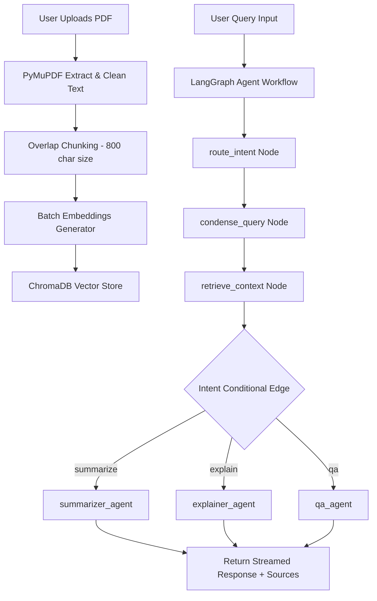

# 🧠 SmartDocs AI – Research Paper Assistant

SmartDocs AI is a full-stack, RAG-powered research assistant. It allows you to upload academic papers (PDF format) and interact with them in real-time. By leveraging Google Gemini embeddings, ChromaDB, Groq, and a LangGraph workflow, the assistant intelligently detects search intents (Summarize, Explain, or Q&A) and generates highly grounded answers backed by specific source context.

---

## 📸 Premium Design Aesthetics & User Experience
The application is styled with a sleek dark-space radial gradient depth (`radial-gradient(circle at 50% 50%, #161930 0%, #0a0c14 100%)`), glassmorphism cards, smooth animations, and hover-triggered interaction details (such as the document delete icons). It features full streaming tokens and structured markdown rendering inside the chat bubbles for an outstanding interface.

---

## 🛠️ Complete Technical Architecture



### 1. The Ingestion Pipeline
1. **PDF Text Extraction**: PyMuPDF (`fitz`) parses the uploaded file and adds page numbering hints (`[Page X]`).
2. **Overlap Chunking**: Chunks are generated (800 characters, 120 character overlap) and split at sentence boundaries.
3. **ChromaDB Storage**: Chunks are stored in collections named `doc_{doc_id}` inside the `backend/chroma_db` folder.

### 2. Rate-Limiting & Robust Embedding Generation
To prevent **Gemini API free tier rate-limit errors** (`Quota exceeded for embed_content`), document ingestion does not use default wrappers. Instead:
- Chunks are grouped into **batches of 100** and sent in single API calls.
- Ingestion features **exponential backoff retry logic** (`time.sleep(2**retries)`), pausing and retrying if a rate-limit exception occurs.
- Dimension metrics are locked to **768** (for `gemini-embedding-001`).

### 3. LangGraph Intent-Aware Agent Workflow
When chatting, the query runs through a compilation graph (`graph_agent.py`):
1. **`route_intent` (Entry Point)**: Categorizes the raw query into `summarize`, `explain`, or `qa` using regex keyword matches.
2. **`condense_query`**: Uses a lightweight Llama-3 model via Groq and the conversation history to condense the query into a standalone query optimized for search.
3. **`retrieve_context`**: Queries ChromaDB using the condensed search query.
4. **Conditional Edge**: Routes state to the appropriate agent:
   - **`summarizer`**: Formulates a structured outline (Main Objective, Methodology, Key Findings, Conclusions) strictly from context.
   - **`explainer`**: Rewrites complex concepts in simple teacher-like language.
   - **`qa_assistant`**: Grounded precision answering. If the answer is missing, it returns exactly: *"Not found in document."*

---

## 📡 API Endpoints (FastAPI)

| Method | Route | Description |
|---|---|---|
| `GET` | `/health` | Server status check |
| `POST` | `/upload` | Extract, chunk, batch embed, and store a PDF |
| `GET` | `/documents` | List metadata for all active documents |
| `DELETE` | `/documents/{doc_id}` | Wipe ChromaDB collection & uploads for a document |
| `POST` | `/chat/stream` | Stream RAG agent tokens via Server-Sent Events (SSE) |

---

## 🚀 Local Development Setup

### Prerequisites
* Python 3.9+ and Node.js 18+
* API keys for Google Gemini and Groq

### 1. Backend Setup
1. Open a terminal and navigate to the `backend` folder.
2. Ensure you have activated your virtual environment:
   ```powershell
   # On Windows
   & "..\venv\Scripts\Activate.ps1"
   ```
3. Install dependencies:
   ```powershell
   pip install -r requirements.txt
   ```
4. Create a `.env` file in the `backend` folder:
   ```env
   GEMINI_API_KEY=your_gemini_key
   GROQ_API_KEY=your_groq_key
   ```
5. Run the server:
   ```powershell
   uvicorn main:app --reload --port 8000
   ```

### 2. Frontend Setup
1. Open a separate terminal tab and navigate to the `frontend` folder.
2. Install packages:
   ```powershell
   npm install
   ```
3. Start the dev server:
   ```powershell
   npm run dev
   ```
4. Access the web interface at `http://localhost:5173`.
